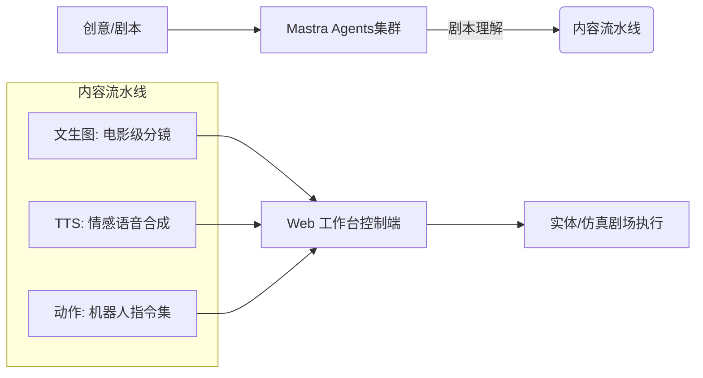

<div align="center">
  
  <h1>🎭 微境剧场 (Weijing Theater)</h1>
  <p><b>基于百度飞桨与文心大模型的桌面微缩剧场多智能体协同演绎系统</b></p>

  <div>
    
    
    
    
  </div>

  <br />

  

  <p align="center">
    <i>“让 AI 走出屏幕，在方寸桌面上演人生百态。”</i>
  </p>
</div>

---
 
## 🌟 项目简介
 
**微境剧场** 是一款专为桌面级微缩场景打造的**具身智能 (Embodied Intelligence)** 协同演播系统。它旨在通过多智能体协作，将纯文本脚本转化为包含“剧情理解、视觉资产生成、音频合成、实体控制”的完整闭环。
 
我们不仅在数字空间内构建了一个强大的内容流水线，更探索了 AI Agent 如何指挥实体机器人在物理边界内进行情感表达与群体协作，赋能数字展陈、智能玩具及沉浸式叙事等前沿领域。
 
---
 
## 🎬 演示视频与项目文档
 
为了方便您快速了解微境剧场的架构设计与演绎效果，我们提供了以下演示视频与技术方案：
 
* **演示视频**
  * 💾 [百度网盘在线观看与下载 (提取码: 6666)](https://pan.baidu.com/s/1hLoS7G33E2w0WX9S-EYQlw?pwd=6666)
  * 🎥 *本地播放*：若已克隆本仓库，可直接播放本地路径下的 [demo_video.mp4](./docs/contest/demo_video.mp4)。
* **系统文档与幻灯片**
  * 📄 [项目概要介绍 (PDF)](./docs/contest/project_summary.pdf) —— 核心设计亮点与系统概要概述。
  * 📄 [项目详细方案 (PDF)](./docs/contest/project_proposal.pdf) —— 系统的完整技术设计与演进路线。
  * 📊 [项目简介 PPT (PPTX)](./docs/contest/project_slides.pptx) —— 系统介绍与答辩演示幻灯片。
* **深度技术参考**
  * ⚙️ [产品使用说明 (PDF)](./docs/contest/enterprise_materials/system_architecture_and_workflow.pdf) —— 多智能体管线与前端交互说明。
  * 🤖 [虚实部署与对比分析 (PDF)](./docs/contest/enterprise_materials/virtual_to_physical_deployment.pdf) —— 虚实映射、动作同步与硬件调试。
  * 📝 [开发过程与训练记录 (PDF)](./docs/contest/enterprise_materials/development_process_and_training_records.pdf) —— 团队分工与模型微调记录。
 
---

## ✨ 核心特性

| 🚀 自动化管线 | 🤖 多智能体协作 | 🎨 极简美学 | 📦 全方位生态 |
| :--- | :--- | :--- | :--- |
| 从原始文本到分镜图像与配音的**端到端生成**，仅需输入一个创意点。 | 内置 5 大职能 Agent，基于 **Mastra** 框架实现任务自治与复杂调度。 | 深度参考 **Figma 设计语言**，纯黑白高阶感 UI，将视觉中心留给创意内容。 | 支持 OpenAI, Gemini, MiniMax 等多模型热切换，采用 **SQLite + Drizzle** 极简架构。 |

---

## 🧠 多智能体架构 (Agent Orchestration)

基于 `Mastra` 框架，系统将复杂的创作过程拆解为五个核心决策节点，每个 Agent 各司其职却又连贯协作：

1.  **✍️ 剧本改写 Agent (`script_rewriter`)**：将小说或灵感转化为标准剧本格式，包含动作描写与对白。
2.  **🔍 特征提取 Agent (`extractor`)**：从剧本中智能去重并提取角色外貌、性格及场景氛围描述。
3.  **🎬 分镜拆解 Agent (`storyboard_breaker`)**：细化每一个镜头的时间、景别、运镜及机位，确保演绎的连续性。
4.  **🎙️ 音色指派 Agent (`voice_assigner`)**：根据角色设定，从音库中自动匹配最契合的角色配音。
5.  **🖼️ 提示词调度 Agent (`grid_prompt_generator`)**：为 AI 生图引擎生成极具电影感和风格一致性的中英双语提示词。

---

## 🏗️ 技术架构



- **前端**: Nuxt 3 (SSR) + Vue 3，极致响应式交互方案。
- **后端**: Hono Server，极轻量、类型安全的高并发 API。
- **持久层**: Drizzle ORM + better-sqlite3，单文件持久化，零配置启动。
- **扩展性**: 支持通过 `SKILL.md` (Natural Language Programming) 动态扩展 Agent 能力。

---

## 🚀 快速开始

### 1. 环境准备
确保您的机器已安装：
- **Node.js** v20+
- **npm** v9+

### 2. 获取与配置
```bash
git clone https://github.com/chatfire-AI/micro-stage.git
cd micro-stage

# 配置 API Key (文心、OpenAI 等)
cp configs/config.example.yaml configs/config.yaml
```

### 3. 开发环境启动
系统采用双进程模式，推荐在两个终端分别运行：

```bash
# 启动后端 (默认端口 5679)
cd backend && npm install && npm run dev

# 启动前端 (默认端口 3013)
cd ../frontend && npm install && npm run dev
```
访问 `http://localhost:3013` 开启您的微缩剧场之旅。

---

## 🛠️ 部署指南 (Docker)

使用 Docker Compose 一键启动前后端全栈资源：

```bash
docker-compose up -d
```
> [!TIP]
> 配置文件和数据库已通过 `volumes` 映射到本地 `configs/` 和 `data/` 目录，容器重启不会丢失任何剧本素材。

---

<div align="center">

  <p>© 2026 Weijing Theater Team. All Rights Reserved.</p>
</div>
