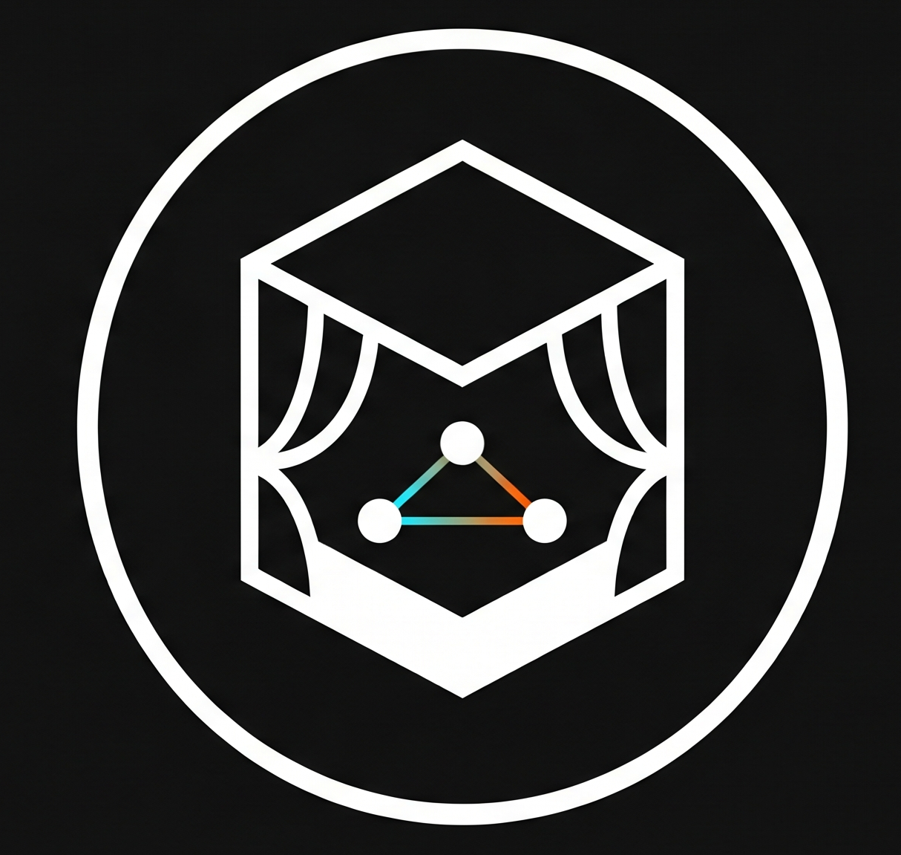
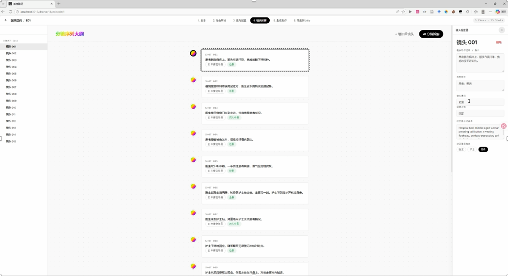
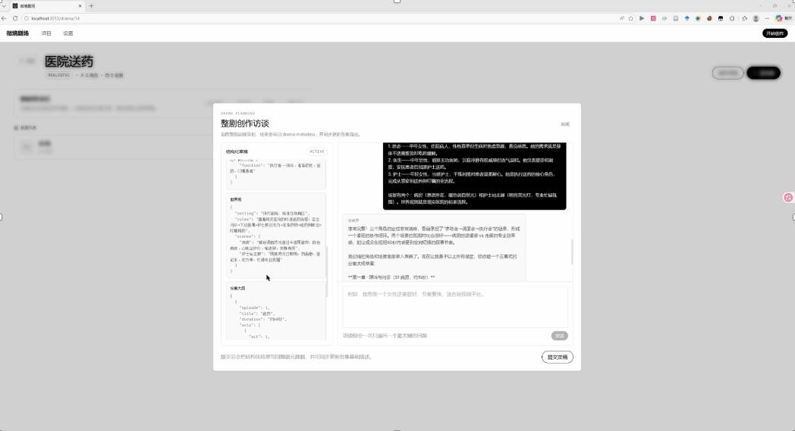
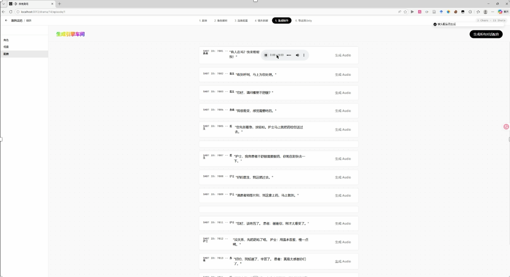
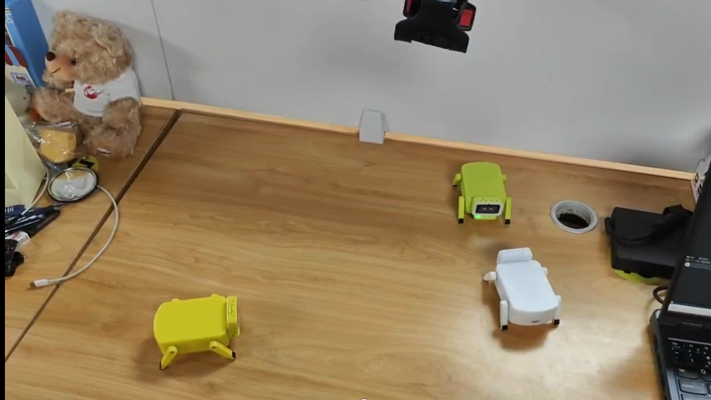

<p align="center">
  
</p>

# 微境剧场 · WeiJing Theater

**把一句创意整理成剧本、角色、场景和结构化分镜，为短剧创作与实体机器人表演准备内容。**

创作者先与访谈 Agent 一起明确人物、冲突和剧情结构，再确认创作草稿。后续 Agent 分阶段处理剧本、角色场景、分镜和配音，每一步的结果都能在工作台中查看与修改。

<p align="center">
  
</p>

[项目演示（提取码 6666）](https://pan.baidu.com/s/1hLoS7G33E2w0WX9S-EYQlw?pwd=6666) · [项目方案](docs/contest/project_proposal.pdf) · [核心设计](#核心设计) · [本地运行](#本地运行)

## 从创意到表演素材

<table>
  <tr>
    <td width="50%"></td>
    <td width="50%"></td>
  </tr>
  <tr>
    <td align="center">对话补齐创作规范，确认后定稿</td>
    <td align="center">按分镜组织配音，逐项检查产物</td>
  </tr>
</table>

工作台保留中间产物：人物设定、世界观、分集大纲、剧本、分镜与音频。创作意图需要调整时，可以回到对应阶段修改，再继续生成后续内容。

<details>
<summary>查看团队实体演示</summary>

<p align="center">
  
</p>

图片来自团队项目演示。整体项目探索从结构化创作内容到实体表演的衔接，本仓库主要提供创作工作台、Agent 工具与素材管理实现。相关背景见[虚实部署说明](docs/contest/enterprise_materials/virtual_to_physical_deployment.pdf)。

</details>

## 核心设计

### 先形成可修改的创作规范

访谈 Agent 维护创作简报、人物设定、世界观和分集大纲。对话阶段持续更新结构化草稿，创作者通过“提交定稿”进入后续创作流程。

这样可以先检查人物与剧情是否符合意图，再投入后面的图像、分镜和配音生成。

### 按阶段分配 Agent 与工具

剧本改写、角色场景提取、分镜拆解、提示词生成和配音分工处理。Skills 提供各阶段的工作约定，工具负责读写具体产物，前端展示阶段与结果。

Skills 中的约定需要与工具实现配合：关键数据约束应在写入前检查，不能仅依赖提示词。

### 分镜引用需要属于当前集

分镜包含镜头描述、时长、场景、角色和对白等字段。除 Zod 输入结构约束外，`validateStoryboardBindings` 会检查场景 ID 与角色 ID 是否属于当前集；错误引用在写入前被拒绝。

这使分镜与已有角色、场景保持关联，也为后续素材生成和表演调度提供可检查的输入。

## 代码导览

| 模块 | 实现入口 |
| --- | --- |
| 创作访谈、草稿与定稿 | [creative.ts](backend/src/routes/creative.ts) |
| Agent 配置与装配 | [agents/index.ts](backend/src/agents/index.ts) |
| Skills 加载与阶段约定 | [skills.ts](backend/src/agents/skills.ts)、[skills/](skills/) |
| 分镜工具与实体引用校验 | [storyboard-tools.ts](backend/src/agents/tools/storyboard-tools.ts) |
| 数据模型 | [schema.ts](backend/src/db/schema.ts) |
| 前端创作工作台 | [frontend/app/pages/](frontend/app/pages/) |

前端使用 Nuxt 3 / Vue，后端使用 Hono / TypeScript，Agent 基于 Mastra，数据通过 Drizzle / SQLite 保存。图像和语音生成由可配置的服务适配器接入。

## 本地运行

准备 Node.js 20+ 和 npm。首次安装需要下载依赖，并可能编译 SQLite 原生模块。

```bash
git clone https://github.com/KingYeon-Zoo/WeiJing-Theater.git
cd WeiJing-Theater
cd backend
npm install
npm run dev
```

在第二个终端，从仓库目录启动前端：

```bash
cd frontend
npm install
npm run dev
```

访问 `http://localhost:3013`，在设置页配置模型服务与凭证。后端默认端口为 `5679`，健康检查地址为 `http://localhost:5679/api/v1/health`。密钥与模型配置因服务商而异，生成内容前请确认对应配置可用。

也可在仓库根目录使用现有 Docker 配置：

```bash
docker compose up -d --build
```

容器入口为 `http://localhost:5679`，数据挂载见 [docker-compose.yml](docker-compose.yml)。

## 项目资料

- [系统架构与工作流程](docs/contest/enterprise_materials/system_architecture_and_workflow.pdf)
- [项目概要](docs/contest/project_summary.pdf)
- [项目演示幻灯片](docs/contest/project_slides.pptx)

这是团队项目的公开仓库。首页展示创作系统与整体演示，代码目录对应各阶段的公开实现。
